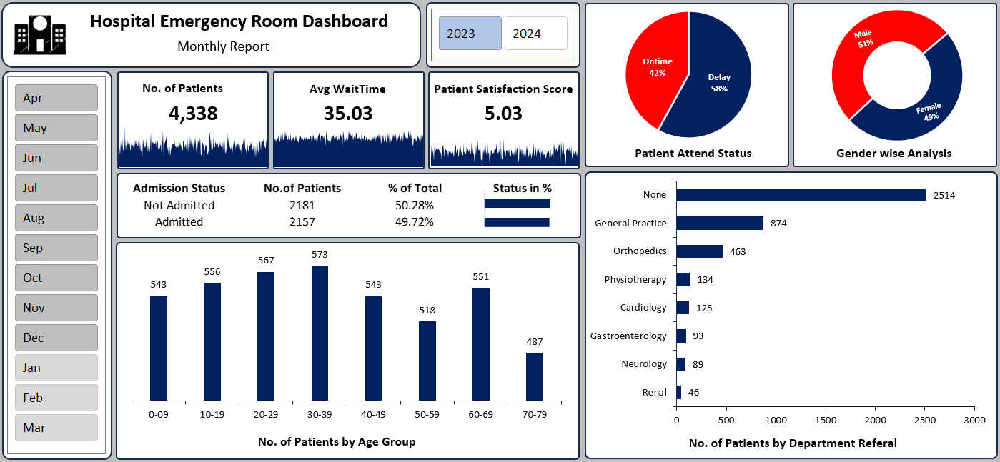
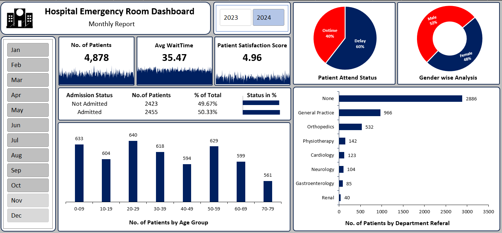
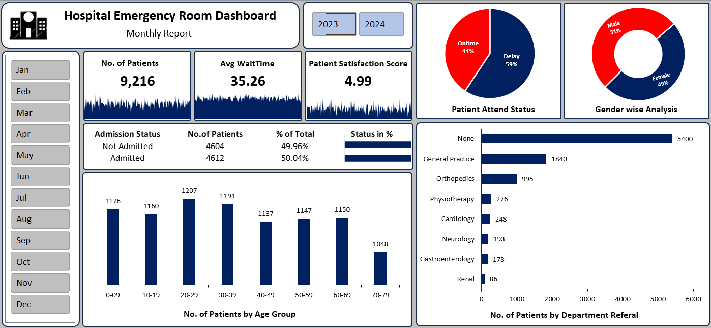

# hospital-emergency-room-dashboard
Excel Dashboard using Power Query &amp; Power Pivot to analyze hospital ER data (2023–2024)

# 🏥 Hospital Emergency Room Dashboard (Excel Project)

## 📊 Overview

This project showcases an interactive **Hospital Emergency Room Dashboard** built using **Microsoft Excel**, leveraging advanced features like **Power Query** and **Power Pivot**.

The dashboard provides insights into hospital emergency room operations for **2023 and 2024**, focusing on patient flow, efficiency, and performance metrics.

---

## ⚙️ Tools & Technologies

* Microsoft Excel
* Power Query (Data Cleaning & Transformation)
* Power Pivot (Data Modeling & Relationships)
* Pivot Tables & Pivot Charts
* Excel Dashboard Design

---

## 🔄 Project Workflow

### 🧹 Data Cleaning (Power Query)

* Removed duplicates and handled missing values
* Standardized data formats
* Transformed raw data into structured tables

### 🔗 Data Modeling (Power Pivot)

* Created relationships between multiple tables
* Built an optimized data model
* Developed calculated columns and measures

### 📊 Dashboard Creation

* Designed interactive dashboard using:

  * KPI Cards
  * Slicers (Month & Year filters)
  * Charts (Bar, Pie, Donut)
  * Trend Analysis

---

## 📈 Key Metrics

* 👥 Total Patients
* ⏱ Average Wait Time
* 😊 Patient Satisfaction Score
* 🏥 Admission vs Non-Admission
* 📊 Age Group Distribution
* 👨‍⚕️ Department Referrals
* ⚖️ Gender Analysis
* ⏳ On-time vs Delayed Attendance

---

## 📸 Dashboard Preview

### 🔹 2023 Dashboard



### 🔹 2024 Dashboard



### 🔹 Combined Dashboard (2023–2024)



---

## 📊 Key Insights

* Patient volume increased from 2023 to 2024
* Average wait time remained stable (~35 minutes)
* Admission rate is nearly balanced (around 50%)
* Majority of patients required no referral or general practice
* Gender distribution is nearly equal
* Most patients fall in the 20–39 age group

---

## 🚀 How to Use

1. Download the Excel file
2. Open in Microsoft Excel (2016 or later recommended)
3. Use slicers to filter by month and year
4. Interact with charts and KPIs

---

## 📁 Project Structure

```
hospital-emergency-room-dashboard/
│── Hospital_ER_Dashboard.xlsx
│── README.md
│── .gitignore
│── images/
│   ├── dashboard_2023.png
│   ├── dashboard_2024.png
│   └── dashboard_combined.png
```

---

## 💡 Future Improvements

* Real-time data integration
* Predictive analytics for patient inflow
* Advanced dashboard in Power BI
* Automation using VBA

---

## 👨‍💻 Author

Karan Vaishnav

---

